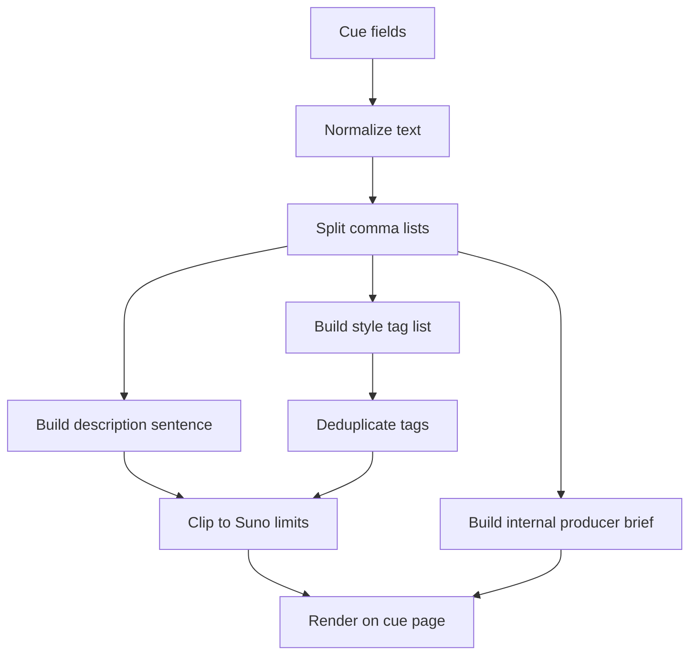

# CMG Music Box Prompting Guide

## 1. Purpose

This document explains how `CMG Music Box` builds Suno-facing prompts today.

It is the practical companion to the architecture reference. Use it when you need to understand:

- who generates the prompt
- what gets pasted into Suno
- why the fields are short
- how cue data is transformed into Suno-compatible text
- what good prompt output looks like for different game situations

## 2. Ownership

### Who generates the prompt?

`CMG Music Box` generates the prompt package locally.

Current implementation:

- builder: [`apps/web/src/lib/prompt-builder.ts`](C:/Users/matth/OneDrive/Dokumente/Playground/cmg_Music_Box/apps/web/src/lib/prompt-builder.ts)
- archetype profiles: [`apps/web/src/lib/cue-archetypes.ts`](C:/Users/matth/OneDrive/Dokumente/Playground/cmg_Music_Box/apps/web/src/lib/cue-archetypes.ts)
- main function: `buildPromptPackage()`

This is important because prompt construction is domain logic, not a Suno responsibility.

The app knows:

- game context
- cue purpose
- gameplay intensity
- loop requirements
- engine target
- licensing target
- instrumentation preferences
- negative constraints

Suno only receives the final compact fields that the user pastes into the Suno UI.

## 3. Current Suno Field Model

The app currently targets Suno Advanced mode and produces two main user-pasteable fields plus one internal field.

| Field | Used in Suno | Limit | Purpose |
|---|---|---:|---|
| `descriptionPrompt` | `Describe your lyrics` | 200 | compact scene + gameplay intent |
| `stylePrompt` | `Enter style tags` | 200 | style, mood, tempo, instrumentation tags |
| `producerBrief` | not pasted by default | internal | full creative intent for the user |

Additional Suno field:

| Field | Used in Suno | Limit | Purpose |
|---|---|---:|---|
| `Write Lyrics` | optional | 3000 | only when the user wants explicit lyrics |

These current limits were verified from the official Suno UI on `2026-03-06`.

## 3.1 Cue archetypes

The prompt builder now also accepts a `cueArchetype` field.

Current archetypes:

- `custom`
- `stealth`
- `exploration`
- `combat`
- `boss`
- `menu`
- `victory`
- `defeat`
- `dialogue`

The archetype changes:

- the cue noun used in the description field
- the built-in style tags
- the gameplay-role note in the internal brief
- the evaluation framing in the Suno handoff steps

Implementation source:

- [`apps/web/src/lib/cue-archetypes.ts`](C:/Users/matth/OneDrive/Dokumente/Playground/cmg_Music_Box/apps/web/src/lib/cue-archetypes.ts)

## 4. Current Output Shape

`buildPromptPackage()` returns:

- `title`
- `descriptionPrompt`
- `stylePrompt`
- `producerBrief`
- `styleKeywords`
- `engineNote`
- `handoffSteps`
- `releaseChecklist`

The important architectural split is:

- short fields for Suno
- longer reference for humans

## 4.1 Cue page handoff UX

The cue page renders the current Suno package with:

- a character counter for `Description field`
- a character counter for `Style field`
- copy buttons for both Suno-facing fields
- a copy button for the internal producer brief

Current rendering:

- cue page: [`apps/web/src/app/projects/[projectId]/cues/[cueId]/page.tsx`](C:/Users/matth/OneDrive/Dokumente/Playground/cmg_Music_Box/apps/web/src/app/projects/[projectId]/cues/[cueId]/page.tsx)
- copy button component: [`apps/web/src/components/copy-text-button.tsx`](C:/Users/matth/OneDrive/Dokumente/Playground/cmg_Music_Box/apps/web/src/components/copy-text-button.tsx)

## 5. Prompt Generation Strategy

### 5.1 Description field strategy

The description field is the short musical brief.

It compresses:

- cue type
- scene summary
- mood
- energy
- tempo
- loop or ending behavior

Current pattern:

```text
Instrumental game cue; for <scene>; <mood>; <energy> energy; <tempo>; <loop or ending note>.
```

Design goal:

- one compact sentence
- immediately understandable by Suno
- safe under `200` characters

### 5.2 Style field strategy

The style field is a tag cluster, not a prose paragraph.

It combines:

- archetype tags
- mood fragments
- energy level
- tempo hint
- instrumental or vocals mode
- loop-friendly or full-ending mode
- `game soundtrack`
- instruments

Current pattern:

```text
tense, watchful, mysterious, low, around 94 BPM, instrumental, loop-friendly, game soundtrack, analog synth pulse, muted percussion
```

Design goal:

- dense musical metadata
- easy to clip if needed
- better suited to Suno's style field than full prose

### 5.3 Producer brief strategy

The producer brief is intentionally longer.

It preserves:

- full scene text
- structure notes
- vocal policy
- avoid terms
- engine considerations
- reference notes

Design goal:

- keep the real production intent visible
- do not lose nuance just because Suno fields are short

## 6. Current Heuristics

The current builder is deterministic, not LLM-driven.

That means:

- no model call
- no separate AI service
- no hidden inference step outside the codebase

Current heuristics:

1. Normalize whitespace
2. Split comma-separated input fields
3. Deduplicate style tokens
4. Strip trailing punctuation when clipping
5. Clip on word boundaries when possible
6. Add `...` only when truncation is required

This logic exists in [`apps/web/src/lib/prompt-builder.ts`](C:/Users/matth/OneDrive/Dokumente/Playground/cmg_Music_Box/apps/web/src/lib/prompt-builder.ts).

## 7. Why The Prompts Are Short

This is not a quality downgrade. It is a system constraint response.

The prompt package used to be too long because it mixed:

- scene narrative
- instrumentation
- structure
- engine note
- negative prompts
- reference notes

into one field.

That worked conceptually, but not operationally, because Suno rejected it.

The current architecture fixes that by separating:

- operationally valid Suno fields
- internal human-readable context

## 8. Input Authoring Rules For Users

If the user wants better prompt output, they should write better cue data.

Good cue inputs are:

- concrete
- musical
- gameplay-aware
- not overloaded with lore

### Good `sceneDescription`

```text
The player sneaks through a frozen docking bay while distant machinery hums and patrols pass overhead.
```

### Bad `sceneDescription`

```text
This is about the deep emotional pain of humanity facing the unknown in a fragmented political cosmos where technology and memory collide and the player maybe feels many things.
```

### Good `mood`

```text
tense, watchful, mysterious
```

### Bad `mood`

```text
good but sad and maybe also epic and emotional and uplifting and cool
```

### Good `primaryInstruments`

```text
analog synth pulse, muted percussion, sub bass drone
```

### Bad `primaryInstruments`

```text
everything cinematic
```

## 9. Recommended Prompting Rules

### Rule 1

Always encode gameplay function, not just genre.

Examples:

- `loop-friendly`
- `strong ending`
- `instrumental`
- `low energy`
- `boss fight`
- `stealth cue`

### Rule 2

Use short, concrete mood words.

Good:

- tense
- eerie
- hopeful
- warm
- urgent

Avoid:

- very extremely dramatic and kind of emotional

### Rule 3

Prefer instrument nouns over abstract adjectives.

Good:

- analog synth pulse
- taiko drums
- low strings
- brushed drums

Avoid:

- cool texture
- awesome cinematic sound

### Rule 4

Put the loop/end behavior in the prompt explicitly.

For games, this is not optional metadata. It changes whether the output is usable.

### Rule 5

Negative constraints should stay precise.

Good:

- no vocals
- avoid EDM drops
- avoid heroic brass

Bad:

- do not be bad

## 10. Anti-Patterns

### Anti-pattern A: Lore dump

Do not paste full worldbuilding paragraphs into the short Suno fields.

### Anti-pattern B: Contradictory energy

Avoid combinations like:

- low energy
- explosive climax
- calm ambience
- aggressive percussion

unless the cue really needs a mixed structure.

### Anti-pattern C: Style-field prose

The style field should not become a paragraph.

It works better as tags.

### Anti-pattern D: Missing gameplay use

If the prompt says only `dark synthwave`, that may be musically valid but production-useless.

Better:

`dark synthwave, stealth cue, low energy, instrumental, loop-friendly`

## 11. Current Transformation Logic



## 12. Prompt Examples

### 12.1 Sci-fi stealth cue

Cue intent:

- scene: frozen docking bay stealth sequence
- mood: tense, watchful, mysterious
- energy: low
- loop: yes
- instrumental: yes

Description field:

```text
Instrumental game cue; for sneaking through a frozen docking bay under distant machine hum; tense, watchful, mysterious; low energy; around 94 BPM; loop-friendly middle section.
```

Style field:

```text
tense, watchful, mysterious, low, around 94 BPM, instrumental, loop-friendly, game soundtrack, analog synth pulse, muted percussion, sub bass drone, glassy piano fragments
```

Why this works:

- gameplay role is explicit
- instrumentation is concrete
- loop behavior is explicit
- both fields remain Suno-compatible

### 12.2 Fantasy village exploration

Cue intent:

- scene: relaxed town hub
- mood: warm, curious, handmade
- energy: low
- loop: yes
- instrumental: yes

Description field:

```text
Instrumental game cue; for exploring a small fantasy village at dusk; warm, curious, handmade; low energy; gentle pulse; loop-friendly middle section.
```

Style field:

```text
warm, curious, handmade, low, instrumental, loop-friendly, game soundtrack, acoustic guitar, light fiddle, wooden percussion, soft flute, cozy folk
```

### 12.3 Boss fight

Cue intent:

- scene: second-phase boss fight
- mood: brutal, urgent, relentless
- energy: high
- loop: no
- instrumental: yes

Description field:

```text
Instrumental game cue; for a second-phase boss fight against a giant war machine; brutal, urgent, relentless; high energy; fast pulse; strong ending.
```

Style field:

```text
brutal, urgent, relentless, high, instrumental, full ending, game soundtrack, industrial percussion, distorted bass, heavy synth brass, aggressive strings, boss fight
```

### 12.4 Horror ambience

Cue intent:

- scene: abandoned hospital corridor
- mood: eerie, hollow, unstable
- energy: low
- loop: yes
- instrumental: yes

Description field:

```text
Instrumental game cue; for moving through an abandoned hospital corridor in near darkness; eerie, hollow, unstable; low energy; slow pulse; loop-friendly middle section.
```

Style field:

```text
eerie, hollow, unstable, low, instrumental, loop-friendly, game soundtrack, dark drone, scraped metal, distant piano, sub bass rumble, horror ambient
```

### 12.5 Main menu theme

Cue intent:

- scene: title screen
- mood: iconic, mysterious, slightly hopeful
- energy: medium
- loop: yes
- instrumental: yes

Description field:

```text
Instrumental game cue; for the main menu of a mythic sci-fi adventure; iconic, mysterious, slightly hopeful; medium energy; measured pulse; loop-friendly middle section.
```

Style field:

```text
iconic, mysterious, hopeful, medium, instrumental, loop-friendly, game soundtrack, synth choir, low strings, wide pads, subtle percussion, main menu theme
```

## 13. Example Of Good Separation

This is the key pattern the app should preserve:

### Short Suno field

```text
Instrumental game cue; for sneaking through a frozen docking bay; tense, watchful, mysterious; low energy; around 94 BPM; loop-friendly middle section.
```

### Internal producer brief

```text
Cue: Nebula Drifter - Docking Bay Lurk.
Scene: The player creeps through a cold industrial docking bay while distant machines keep humming.
Mood: tense, watchful, mysterious.
Energy: low and patient, with tension hiding under the surface.
Tempo: around 94 BPM.
Target length: around 110 seconds.
Structure: defined intro, stable middle, and an ending that can be edited into a seamless gameplay loop.
Instrumentation: analog synth pulse, muted percussion, sub bass drone, glassy piano fragments.
Vocals: instrumental only.
Avoid: big EDM drops, heroic brass, comedy cues.
```

That is the correct split.

## 14. Future Prompting Enhancements

The current builder is deterministic and reliable. Future improvements can still happen without changing ownership.

Potential upgrades:

- reusable prompt templates per genre
- per-engine prompt tuning
- archetype-driven default values
- archetype-specific quality checks
- optional LLM-assisted compression layer
- quality scoring for cue completeness before prompt generation

Important:

Even if an LLM is introduced later, it should remain an internal helper. The app should still own the final prompt package.

## 15. Recommended Next Improvement

The best next prompting improvement would now be:

- archetype-driven defaults and validation

Examples:

- `boss` defaults to high-energy language and no-loop bias
- `menu` defaults to low-to-medium energy and loop-friendly phrasing
- `dialogue` warns against over-dense percussion or melodic movement

Why:

- less manual tuning for users
- stronger prompt consistency
- fewer contradictory cue briefs

## 16. References

Prompt builder source:

- [`apps/web/src/lib/prompt-builder.ts`](C:/Users/matth/OneDrive/Dokumente/Playground/cmg_Music_Box/apps/web/src/lib/prompt-builder.ts)

Cue archetype source:

- [`apps/web/src/lib/cue-archetypes.ts`](C:/Users/matth/OneDrive/Dokumente/Playground/cmg_Music_Box/apps/web/src/lib/cue-archetypes.ts)

Cue page rendering:

- [`apps/web/src/app/projects/[projectId]/cues/[cueId]/page.tsx`](C:/Users/matth/OneDrive/Dokumente/Playground/cmg_Music_Box/apps/web/src/app/projects/[projectId]/cues/[cueId]/page.tsx)

Copy interaction:

- [`apps/web/src/components/copy-text-button.tsx`](C:/Users/matth/OneDrive/Dokumente/Playground/cmg_Music_Box/apps/web/src/components/copy-text-button.tsx)

Architecture overview:

- [Architecture Reference](C:/Users/matth/OneDrive/Dokumente/Playground/cmg_Music_Box/docs/architecture-reference.md)
