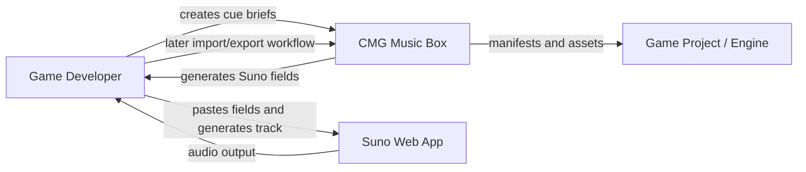
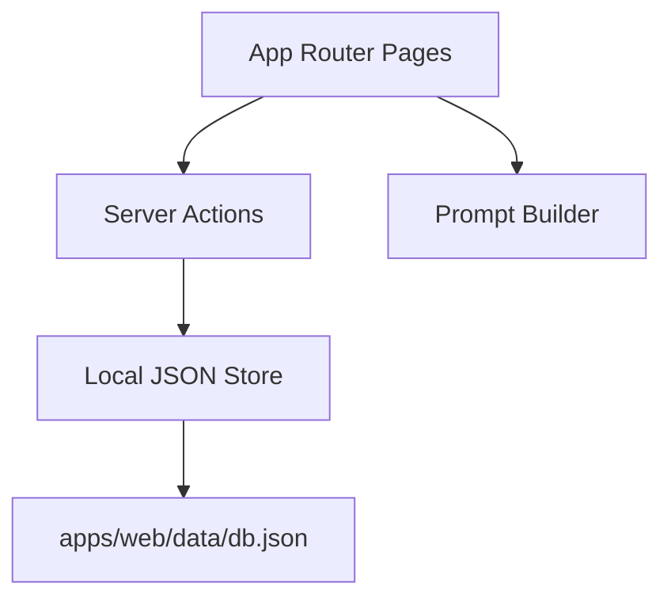
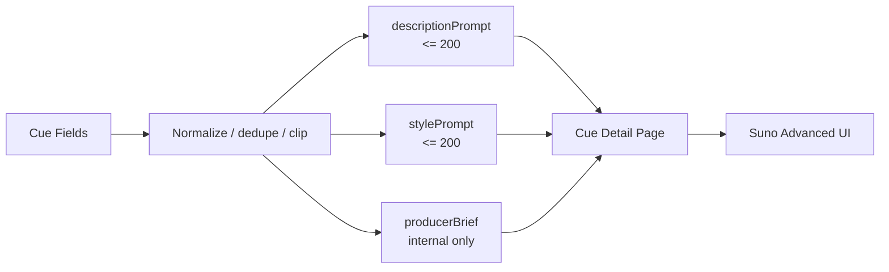
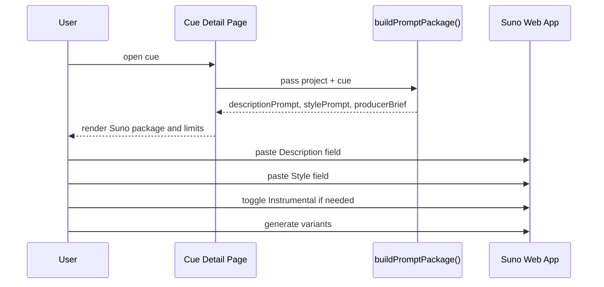
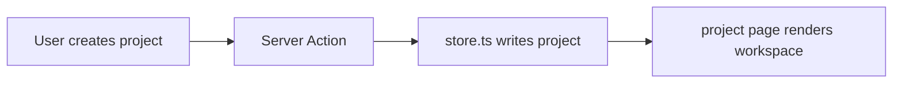
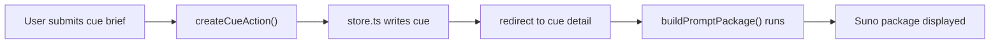
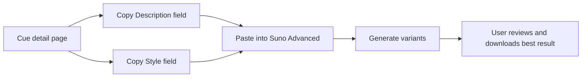
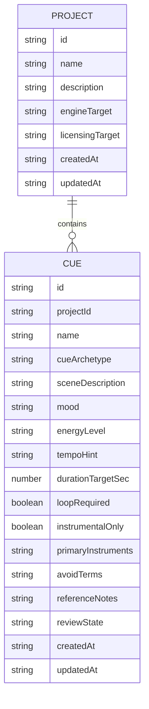
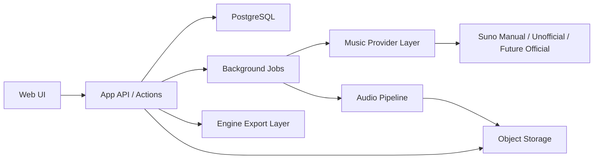

# CMG Music Box Architecture Reference

## 1. Purpose

This document is the single architecture reference for `CMG Music Box`.

It covers:

- product intent
- current MVP architecture
- prompt-generation ownership and flow
- Suno integration boundaries
- data flow
- future evolution path
- operational and legal constraints

## 2. Executive Summary

`CMG Music Box` is a game-music workflow application that helps a developer turn a gameplay situation into a structured music request, then hand that request off to Suno in a way that is reproducible, reviewable, and later exportable for game-engine use.

The current product intentionally does **not** depend on a public Suno API. Instead, it treats Suno as an external generation provider and focuses first on the durable workflow:

- project setup
- cue briefs
- prompt generation
- manual Suno handoff
- review discipline

## 3. The Short Answer

### Who generates the prompt?

`CMG Music Box` generates the prompt, not Suno.

Specifically:

- the prompt package is built locally in [`apps/web/src/lib/prompt-builder.ts`](C:/Users/matth/OneDrive/Dokumente/Playground/cmg_Music_Box/apps/web/src/lib/prompt-builder.ts)
- the main entry point is `buildPromptPackage()`
- the cue detail page renders that package in [`apps/web/src/app/projects/[projectId]/cues/[cueId]/page.tsx`](C:/Users/matth/OneDrive/Dokumente/Playground/cmg_Music_Box/apps/web/src/app/projects/[projectId]/cues/[cueId]/page.tsx)

Suno only receives the final user-pasted fields:

- `Description field`
- `Style field`
- optionally later, `Write Lyrics`

### Why is that important?

Because prompt generation is a core product capability of this app. If Suno changes its UI or provider model, the project still keeps:

- game context
- cue logic
- prompt recipes
- reproducibility
- legal provenance

## 4. Product Goal

The application should turn a brief like this:

> Forest at night, low threat, mysterious, no vocals, 90-100 BPM, loopable, 2 minutes

into this:

- structured cue data
- a Suno-compatible prompt package
- a clear handoff workflow
- track review metadata
- future game-ready exports

## 5. Core Constraints

### 5.1 Suno is a provider, not the platform

The architecture deliberately avoids making Suno the source of truth.

The source of truth lives in `CMG Music Box`:

- project
- cue
- prompt package
- review state
- later: imported assets and exports

### 5.2 Current Suno boundary

As of `2026-03-06`, I could not find a documented public developer API in official Suno documentation. That means the safest current architecture is:

- manual Suno handoff first
- automation only later
- provider abstraction from day one

### 5.3 Suno field limits

The current prompt generator now targets the official Suno web UI field limits verified directly in the Suno app UI:

| Field | Limit | Status |
|---|---:|---|
| `Describe your lyrics` | 200 chars | verified in official Suno UI |
| `Enter style tags` | 200 chars | verified in official Suno UI |
| `Add your own lyrics here` | 3000 chars | verified in official Suno UI |

Important:

- these limits were verified from the official Suno web app UI
- I did not find a separate Help Center article that publishes these numbers directly

## 6. Architecture Principles

The system follows these rules:

1. `CMG Music Box` owns the workflow.
2. Suno is replaceable at the provider edge.
3. Prompt generation is deterministic and local.
4. User-visible generation input must respect current Suno UI limits.
5. The architecture should remain useful even if automation breaks.

## 7. System Context

## 8. Current MVP Architecture

### 8.1 Runtime shape

The current MVP is a single Next.js application with local JSON persistence.

### 8.2 Current implementation map

| Responsibility | Current file |
|---|---|
| dashboard and project listing | [`apps/web/src/app/page.tsx`](C:/Users/matth/OneDrive/Dokumente/Playground/cmg_Music_Box/apps/web/src/app/page.tsx) |
| form handling and mutations | [`apps/web/src/app/actions.ts`](C:/Users/matth/OneDrive/Dokumente/Playground/cmg_Music_Box/apps/web/src/app/actions.ts) |
| project storage and cue storage | [`apps/web/src/lib/store.ts`](C:/Users/matth/OneDrive/Dokumente/Playground/cmg_Music_Box/apps/web/src/lib/store.ts) |
| cue archetype profiles | [`apps/web/src/lib/cue-archetypes.ts`](C:/Users/matth/OneDrive/Dokumente/Playground/cmg_Music_Box/apps/web/src/lib/cue-archetypes.ts) |
| prompt generation | [`apps/web/src/lib/prompt-builder.ts`](C:/Users/matth/OneDrive/Dokumente/Playground/cmg_Music_Box/apps/web/src/lib/prompt-builder.ts) |
| project workspace page | [`apps/web/src/app/projects/[projectId]/page.tsx`](C:/Users/matth/OneDrive/Dokumente/Playground/cmg_Music_Box/apps/web/src/app/projects/[projectId]/page.tsx) |
| cue detail and Suno handoff page | [`apps/web/src/app/projects/[projectId]/cues/[cueId]/page.tsx`](C:/Users/matth/OneDrive/Dokumente/Playground/cmg_Music_Box/apps/web/src/app/projects/[projectId]/cues/[cueId]/page.tsx) |
| copy-to-clipboard UI control | [`apps/web/src/components/copy-text-button.tsx`](C:/Users/matth/OneDrive/Dokumente/Playground/cmg_Music_Box/apps/web/src/components/copy-text-button.tsx) |

## 9. Prompt Generation Architecture

### 9.1 Ownership

Prompt generation is a local domain capability.

It is generated by:

- `buildPromptPackage(project, cue)`

It outputs:

- `title`
- `cueArchetype`-aware framing
- `descriptionPrompt`
- `stylePrompt`
- `producerBrief`
- `styleKeywords`
- `handoffSteps`
- `releaseChecklist`

### 9.2 Why the app generates the prompt

The app has richer context than Suno:

- game title
- engine target
- licensing target
- cue archetype
- scene brief
- mood
- energy
- target duration
- loop requirement
- instrumentation
- avoid terms
- reference notes

That context is domain knowledge. Suno is just the external generator that consumes a compressed version of it.

### 9.3 Prompt outputs

The prompt builder now intentionally produces two layers:

#### User-pasteable Suno fields

- `descriptionPrompt`
- `stylePrompt`

These are short, clipped, and safe against Suno UI limits.

#### Internal-only production reference

- `producerBrief`

This keeps the full cue intent visible to the user inside `CMG Music Box`, but it is not the primary thing the user pastes into Suno.

### 9.4 Prompt generation pipeline

### 9.5 Sequence of prompt creation

## 10. Current Prompt Strategy

### 10.1 Description field

Purpose:

- one short musical brief
- enough context for Suno to understand scene + intent
- hard-capped to `200`

Current construction strategy:

- short cue type
- compressed scene
- mood
- energy
- tempo
- loop/end behavior

### 10.2 Style field

Purpose:

- compact style/instrumentation tag cluster
- hard-capped to `200`

Current construction strategy:

- mood keywords
- energy
- tempo
- instrumental/vocals mode
- loop/full-ending mode
- `game soundtrack`
- instruments

### 10.3 Producer brief

Purpose:

- show the full creative reasoning to the user
- preserve all cue intent in the app
- support later reproducibility

This is intentionally longer and internal.

## 11. Current User Flows

### 11.1 Project creation flow

### 11.2 Cue creation flow

### 11.3 Manual Suno flow

The cue page now exposes:

- copy buttons for `Description field` and `Style field`
- a copy button for the internal producer brief
- visible character counters for both Suno-facing fields

## 12. Data Model

### 12.1 Current logical model

### 12.2 Current persistence model

The MVP persists data locally in:

- [`apps/web/data/db.json`](C:/Users/matth/OneDrive/Dokumente/Playground/cmg_Music_Box/apps/web/data/db.json)

This is implementation-convenient, not the final target architecture.

## 13. Proposed Target Architecture

The future architecture should separate concerns more clearly.

## 14. Provider Strategy

### 14.1 Current provider mode

Current MVP provider mode:

- `suno-manual`

That means:

- `CMG Music Box` prepares the package
- the human performs the generation in Suno

### 14.2 Future provider modes

Potential later modes:

- `suno-unofficial`
- `future-official`

### 14.3 Why provider abstraction matters

Without a provider boundary, the whole app would be coupled to Suno UI behavior. With a provider boundary, only one edge changes if Suno changes:

- manual flow can remain usable
- prompt generation can remain stable
- project and cue data stay intact

## 15. Prompt Safety and Clipping

The prompt builder uses normalization and clipping logic to avoid unusable output.

Current mechanics:

- trim whitespace
- collapse repeated spaces
- deduplicate style tokens
- clip on word boundaries when possible
- append `...` only when truncation is required

That logic exists because the user-facing requirement is not "maximally detailed text," but "a field Suno accepts right now."

## 16. UI Responsibilities

### 16.1 Dashboard

The dashboard is responsible for:

- project listing
- project creation
- high-level workflow orientation

### 16.2 Project workspace

The project page is responsible for:

- cue creation
- project context display
- cue navigation

### 16.3 Cue detail page

The cue detail page is responsible for:

- cue editing
- prompt package rendering
- copy-to-clipboard controls for Suno fields
- Suno field limits visibility
- manual handoff steps
- release discipline

## 17. Operational Constraints

### 17.1 What the MVP does not do yet

The current MVP does not yet implement:

- asset import
- waveform analysis
- loudness analysis
- loop markers
- export bundles
- provider automation

### 17.2 Why this is acceptable

Because the current system is validating the workflow nucleus first:

- does the cue model make sense?
- are the prompt packages useful?
- does the manual handoff reduce friction?

That is the correct first milestone.

## 18. Legal and Rights Constraints

The architecture must preserve provenance.

At minimum, future versions should store:

- Suno plan tier at generation time
- generation date
- operator/user identity
- whether the cue is approved for commercial use
- whether lyrics were user-written

This matters because official Suno policy differentiates between free-tier and paid-tier outputs for commercial use.

## 19. Planned Evolution

### Phase 1

- current MVP
- project + cue + prompt package + manual handoff

### Phase 2

- asset import
- file metadata
- waveform and loudness
- loop-prep workflow

### Phase 3

- export bundles for Unity, Godot, Unreal
- manifest files

### Phase 4

- experimental provider automation
- background jobs
- collection pipeline

### Phase 5

- stems
- adaptive music exports
- engine-state integration

## 20. Architecture Decisions

### Decision A

Prompt generation belongs to `CMG Music Box`, not Suno.

Reason:

- game context is local domain logic
- reproducibility matters
- Suno is not the system of record

### Decision B

Manual provider is the default first implementation.

Reason:

- lower operational risk
- still useful immediately
- no dependency on unofficial API scraping

### Decision C

Suno-visible fields must target current UI limits, not abstract ideal prompts.

Reason:

- the user needs a field that works now
- prompt quality is irrelevant if the UI rejects it

## 21. Recommended Next Technical Step

The next build step should be:

- asset import pipeline

Why:

- it extends the current manual provider naturally
- it preserves value even without automation
- it prepares the system for waveform, looping, and export work

## 22. Source References

Official Suno references:

- [Suno Model Timeline](https://help.suno.com/en/articles/5782721)
- [Does Suno own the music I make?](https://help.suno.com/en/articles/2416769)
- [Can I distribute my songs to Spotify, etc?](https://help.suno.com/en/articles/2410177)
- [Introduction to Studio](https://help.suno.com/en/articles/7940161)
- [How do I download my songs?](https://help.suno.com/en/articles/2409921)
- [Suno Terms](https://suno.com/terms)

UI-verified Suno field limits:

- verified directly from the official Suno web UI on `2026-03-06`
- `Describe your lyrics = 200`
- `Enter style tags = 200`
- `Add your own lyrics here = 3000`

Ecosystem reference for unofficial automation context:

- [gcui-art/suno-api](https://github.com/gcui-art/suno-api)
