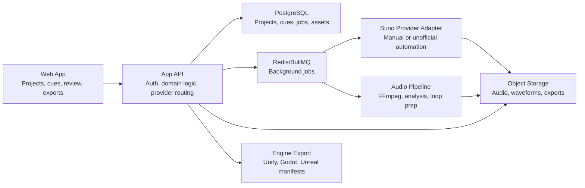

# Architecture

## 1. Product Goal

CMG Music Box should help a game developer turn a gameplay situation into usable music assets.

Example:

- "Forest at night, low threat, mysterious, no vocals, 90-100 BPM, loopable, 2 minutes"

The system should turn that into:

- A structured Suno prompt
- Multiple generated variants
- Reviewable assets with metadata
- Game-ready exports with loop data and manifest files

## 2. Core Constraint: Suno Is A Provider, Not The Platform

The most important planning decision is to avoid coupling the whole product to Suno's current web implementation.

Observed constraints from official and ecosystem sources:

- Suno documents product features, plans, rights, downloads, and Studio workflows.
- Suno officially documents commercial-use rules tied to paid subscription status at generation time.
- Suno officially documents Studio, stems, multitrack export, WAV download, and upload/edit workflows.
- I could not find a documented public developer API in official Suno sources.
- Popular automation projects openly describe themselves as unofficial and rely on cookies, browser automation, and CAPTCHA solving.

Inference:

The app should treat Suno as an unstable external provider and isolate it behind a provider adapter boundary.

## 3. Product Scope

### In scope

- Cue planning for games
- Prompt generation for Suno
- Variant management
- Audio import and storage
- Review workflow
- Metadata and versioning
- Loop preparation
- Export bundles for game engines
- Optional experimental generation automation

### Out of scope for v1

- Public marketplace
- Fully autonomous generation without manual fallback
- Real-time adaptive score generation in-engine
- Fine-grained legal automation beyond capturing plan/tier provenance

## 4. Primary User Flows

### Flow A: Reliable MVP

1. User creates a game project.
2. User defines a cue brief:
   - scene
   - mood
   - energy
   - target length
   - loop requirement
   - instrumental only or vocal
   - instrumentation
   - reference notes
3. System builds a Suno prompt package.
4. User generates in Suno manually.
5. User downloads WAV or MP3 from Suno.
6. User imports the asset into CMG Music Box.
7. System extracts metadata, waveform, loudness, and duration.
8. User reviews variants and marks a winner.
9. System helps define fades, loop points, tags, and export metadata.
10. User exports files and manifest for the target game engine.

### Flow B: Experimental Automation

1. User creates a cue brief.
2. System builds a prompt package.
3. A background worker submits the job through a Suno adapter.
4. The system polls for completion.
5. Generated assets are downloaded and ingested automatically.
6. The rest of the workflow matches Flow A.

## 5. Recommended System Architecture



## 6. Recommended Tech Stack

Use a stack that makes the UI fast to ship while leaving room for async jobs and provider abstraction.

- Frontend + app server: Next.js 15 + TypeScript
- ORM: Prisma
- Database: PostgreSQL
- Job queue: BullMQ + Redis
- Storage: S3-compatible bucket or local object storage in dev
- Audio processing: FFmpeg
- Waveform generation: FFmpeg or audiowaveform
- Optional deeper analysis: Python sidecar with librosa for BPM/key/loop heuristics

Why this stack:

- TypeScript is a good fit for product code plus provider adapters.
- BullMQ is enough for async generation, polling, downloads, and post-processing.
- FFmpeg covers the first serious wave of audio handling without overengineering.
- Python should be optional, not required, until you need better music-analysis quality.

## 7. Provider Model

Define a provider interface early.

```ts
type GenerateCueInput = {
  cueId: string;
  prompt: string;
  lyrics?: string;
  style?: string;
  instrumental: boolean;
  targetDurationSec?: number;
  referenceAssetIds?: string[];
};

type ProviderJob = {
  provider: "suno-manual" | "suno-unofficial" | "future-official";
  externalJobId?: string;
  status: "queued" | "running" | "completed" | "failed";
};

interface MusicProvider {
  submit(input: GenerateCueInput): Promise<ProviderJob>;
  poll(job: ProviderJob): Promise<ProviderJob>;
  collect(job: ProviderJob): Promise<CollectedAsset[]>;
}
```

This is the architectural escape hatch. If Suno changes, you rewrite one adapter, not the whole product.

## 8. Suno Integration Options

| Option | How it works | Reliability | Ops complexity | Risk | Recommendation |
|---|---|---:|---:|---:|---|
| Manual import | App generates prompts, user uses Suno UI, then imports output | High | Low | Low | Best MVP path |
| Browser automation | Playwright drives Suno UI with a real account | Low | High | High | Use only internally |
| Unofficial API proxy | Self-host community wrapper with cookies/CAPTCHA solving | Medium-low | High | High | Experimental only |
| Future official API | Replace adapter when Suno ships one | Unknown | Medium | Low | Design for this now |

### Recommendation

- Ship `suno-manual` first.
- Build `suno-unofficial` second, behind a feature flag and internal-only configuration.
- Keep provider configuration per environment, not per request.

## 9. Audio And Asset Pipeline

The app should treat generated audio as raw material, not final game-ready content.

Pipeline stages:

1. Ingest
   - Store original file
   - Capture source provider and plan/tier context
   - Save prompt, style, and generation notes
2. Analyze
   - Duration
   - Peak and integrated loudness
   - Silence detection at head/tail
   - Waveform preview
   - Optional BPM/key estimate
3. Prepare
   - Trim silence
   - Apply fade in/out
   - Normalize target level
   - Suggest loop in/out points
4. Export
   - WAV and optional MP3/OGG
   - Cue manifest JSON
   - Optional stem package if imported from Suno Studio/Premier workflow

## 10. Data Model

### Core entities

- `project`
  - game title
  - platform targets
  - engine target
- `cue`
  - project id
  - name
  - scene description
  - mood
  - energy
  - target duration
  - loop required
  - vocal mode
- `prompt_template`
  - reusable prompt recipe
  - field mapping
  - genre/style defaults
- `generation_request`
  - cue id
  - provider
  - raw prompt
  - provider payload
  - status
  - cost/credits snapshot
- `track_variant`
  - generation request id
  - version label
  - review state
  - notes
- `asset`
  - variant id
  - original file path
  - processed file path
  - format
  - duration
  - loudness
  - bpm/key estimate
- `loop_marker`
  - asset id
  - start ms
  - end ms
  - confidence
- `export_bundle`
  - asset id
  - engine target
  - manifest path
  - exported files

### Important metadata to preserve

- Suno plan tier at creation time
- Whether the asset was made manually or through automation
- Exact prompt and style text
- Whether lyrics were user-written
- Download format source: MP3, WAV, stems, multitrack

## 11. API Surface

Suggested initial endpoints:

- `POST /api/projects`
- `GET /api/projects/:id`
- `POST /api/cues`
- `PATCH /api/cues/:id`
- `POST /api/cues/:id/prompt-preview`
- `POST /api/cues/:id/generate`
- `GET /api/generation-requests/:id`
- `POST /api/assets/import`
- `POST /api/assets/:id/analyze`
- `POST /api/assets/:id/loop-suggestions`
- `POST /api/assets/:id/export`
- `GET /api/exports/:id`

For v1, `POST /api/cues/:id/generate` can simply create a prompt package and return the text/instructions for manual Suno execution.

## 12. Game-Specific Features Worth Prioritizing

These matter more for games than for general music generation apps:

- Instrumental-first workflows
- Cue briefs tied to scenes or game states
- Variants for low/medium/high intensity
- Loop-aware editing
- Stem-aware imports for adaptive layering
- Export manifests that preserve loop points and tags

If you have a Suno Premier workflow, imported multitracks/stems can later power adaptive music systems:

- percussion layer
- harmonic bed
- melody layer
- tension layer

That is much more useful than shipping single stereo files everywhere.

## 13. Security And Operational Concerns

If you add automation:

- Store Suno cookies and CAPTCHA keys as secrets, never in the database plaintext.
- Isolate the generation worker from the public web process.
- Log all provider failures and HTML/UI changes.
- Expect breakage after Suno UI updates.
- Rate limit and retry conservatively to avoid account lockouts.

## 14. Legal And Rights Constraints

Important implementation rule:

Capture rights context at the moment of generation.

The app should store:

- which Suno plan was active
- who initiated the generation
- whether lyrics came from the user
- whether the asset is approved for commercial game use

This matters because Suno states:

- paid-tier songs may be used commercially
- free-tier songs are non-commercial
- subscribing later does not retroactively convert old free-tier outputs

## 15. Recommended Delivery Strategy

### Phase strategy

1. Build a reliable internal tool without automation dependence.
2. Validate that the cue workflow actually helps game production.
3. Add experimental Suno automation only after the asset library and export pipeline are solid.
4. If Suno releases an official API later, swap adapters and keep the rest of the product intact.

### Bottom-line recommendation

Do not define success as "fully automated Suno generation from day one."

Define success as:

- game briefs become better prompts
- generated music becomes organized assets
- assets become usable in-engine faster

That is the durable product.

## 16. Sources

Official Suno:

- https://help.suno.com/en/articles/5782721
- https://help.suno.com/en/articles/2416769
- https://help.suno.com/en/articles/2410177
- https://help.suno.com/en/articles/7940161
- https://help.suno.com/en/articles/2409921
- https://suno.com/terms

Ecosystem reference:

- https://github.com/gcui-art/suno-api
