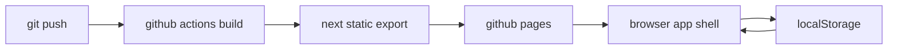

# github pages deploy

## was geändert wurde

1. die app exportiert jetzt statisch für github pages.
2. daten liegen jetzt in `localStorage` statt im server-dateisystem.
3. navigation läuft als hash-route, damit lokal erzeugte ids auf pages funktionieren.

## architektur

## deployment

1. repo auf github öffnen.
2. unter `Settings -> Pages` als source `GitHub Actions` wählen.
3. änderungen nach `main` pushen.
4. auf den workflow `Deploy GitHub Pages` warten.
5. seite unter `https://astrogolem224.github.io/cmg_Music_Box/` öffnen.

## grenzen

1. daten sind pro browser lokal.
2. anderer browser oder privates fenster bedeutet anderer datenstand.
3. für sync oder team-work brauchst du wieder ein backend.
