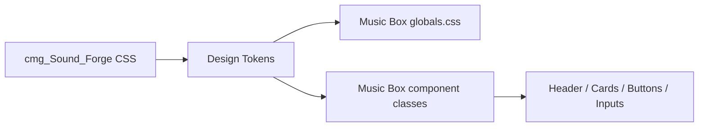

# soundforge visual alignment

## ziel

1. `cmg_Music_Box` optisch auf `cmg_Sound_Forge` angleichen.
2. nicht die komplette app umschreiben, sondern die gemeinsame design-dna sauber übernehmen.

## mapping

1. typografie:
   `Barlow Condensed` fuer headlines und actions, `Inter` fuer ui-text.
2. farben:
   ember orange, cyan focus, dunkles teal statt blau-violett.
3. flaechen:
   kompakte cards mit klarer border und weniger glassmorphism.
4. controls:
   tab-artige secondary buttons und condensed uppercase primary buttons.

## flow

## betroffene dateien

1. `apps/web/src/app/layout.tsx`
2. `apps/web/src/app/globals.css`
3. `apps/web/src/components/music-box-app.tsx`
